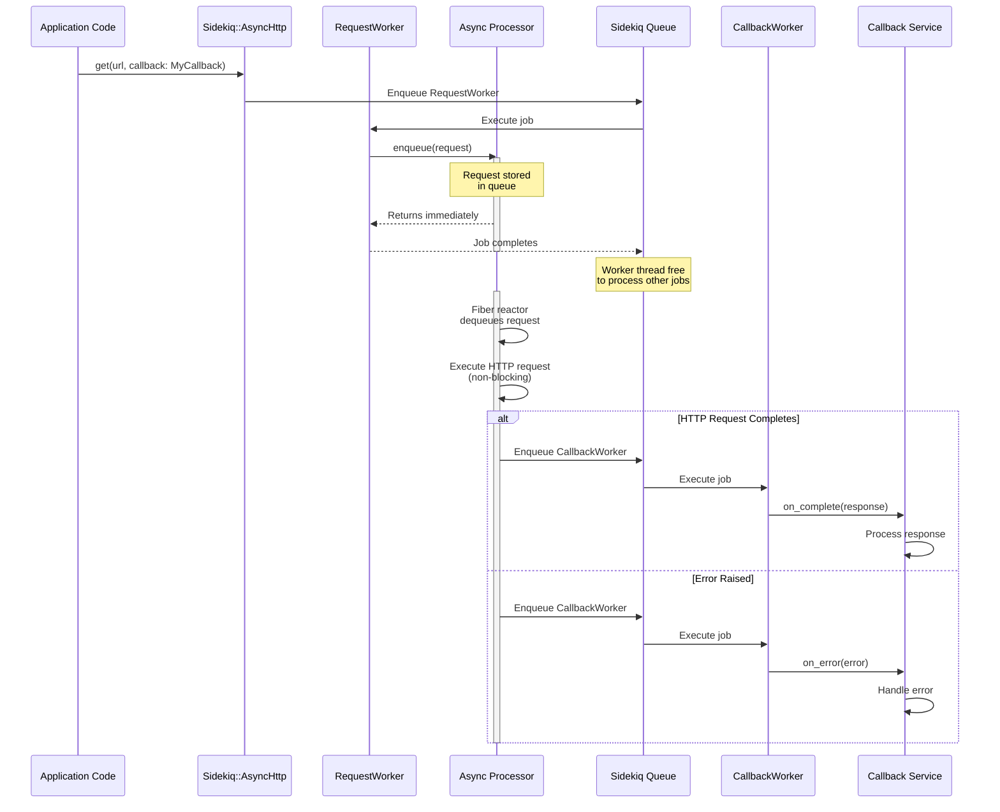
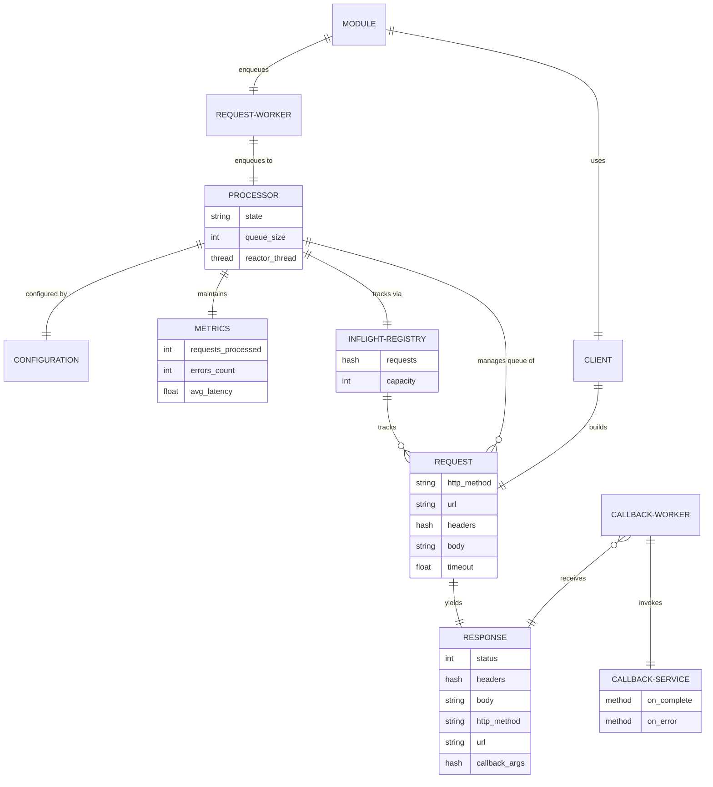

# Architecture

## Overview

Sidekiq::AsyncHttp provides a mechanism to offload long-running HTTP requests from Sidekiq worker threads to a dedicated async I/O processor. The gem uses Ruby's Fiber-based concurrency to handle hundreds of concurrent HTTP requests without blocking worker threads.

## Key Design Principles

1. **Non-blocking Workers**: Worker threads enqueue HTTP requests and immediately return, freeing them to process other jobs
2. **Singleton Processor**: One async I/O processor per Sidekiq process handles all HTTP requests using Fiber-based concurrency
3. **Callback Service Pattern**: HTTP responses are processed by callback service classes with `on_complete` and `on_error` methods
4. **Lifecycle Integration**: Processor lifecycle is tightly coupled with Sidekiq's startup and shutdown

## Core Components

### Processor
The heart of the system - a singleton that runs in a dedicated thread with its own Fiber reactor. Manages the async HTTP request queue and handles concurrent request execution using the `async` gem.

### RequestWorker
A Sidekiq worker that accepts HTTP requests and enqueues them to the async processor. This allows HTTP requests to be made from anywhere in your code (not just Sidekiq jobs).

### CallbackWorker
A Sidekiq worker that invokes callback service methods (`on_complete` or `on_error`) when HTTP requests complete.

### Client
Request builder that constructs HTTP requests with proper URL joining, header merging, and parameter encoding. Provides shared configuration (base URL, headers, timeout) for multiple requests.

### Request/Response
Immutable value objects representing HTTP requests and responses. Responses are serializable so they can be passed to callback workers.

### Inflight Registry
Tracks all in-flight HTTP requests for monitoring, crash recovery, and graceful shutdown.

### Metrics
Collects runtime statistics about request throughput, latency, errors, and processor state.

## Callback Service Pattern

When HTTP requests complete, the processor enqueues CallbackWorker jobs to invoke the appropriate callback service method:

- **Success callbacks**: The `on_complete` method receives a `Response` object with status, headers, body, and callback arguments
- **Error callbacks**: The `on_error` method receives an `Error` object with error details and callback arguments
- **Callback arguments** are passed via the `callback_args:` option and accessed via `response.callback_args[:key]` or `error.callback_args[:key]`

Example:
```ruby
# Define a callback service class
class FetchDataCallback
  def on_complete(response)
    user_id = response.callback_args[:user_id]
    User.find(user_id).update!(data: response.json)
  end

  def on_error(error)
    user_id = error.callback_args[:user_id]
    Rails.logger.error("Failed to fetch data for user #{user_id}: #{error.message}")
  end
end

# Make a request from anywhere in your code
Sidekiq::AsyncHttp.get(
  "https://api.example.com/users/123",
  callback: FetchDataCallback,
  callback_args: {user_id: 123}
)
```

## Request Lifecycle



## Component Relationships



## Process Model

Each Sidekiq process runs:
- Multiple worker threads (configured via Sidekiq concurrency)
- **One** async HTTP processor thread
- **One** fiber reactor within the processor thread

```
┌─────────────────────────────────────────────────────────────┐
│                    Sidekiq Process                          │
│                                                             │
│  ┌──────────────┐   ┌──────────────┐  ┌──────────────┐      │
│  │ Worker       │   │ Worker       │  │ Worker       │      │
│  │ Thread 1     │   │ Thread 2     │  │ Thread N     │      │
│  └──────┬───────┘   └──────┬───────┘  └──────┬───────┘      │
│         │                  │                 │              │
│         └──────────────────┼─────────────────┘              │
│                            │                                │
│                            ▼                                │
│               ┌─────────────────────────┐                   │
│               │  Async HTTP Processor   │                   │
│               │  (Dedicated Thread)     │                   │
│               │                         │                   │
│               │  ┌───────────────────┐  │                   │
│               │  │  Fiber Reactor    │  │                   │
│               │  │  ═════════════    │  │                   │
│               │  │  100+ concurrent  │  │                   │
│               │  │  HTTP requests    │  │                   │
│               │  └───────────────────┘  │                   │
│               └─────────────────────────┘                   │
└─────────────────────────────────────────────────────────────┘
```

## Concurrency Model

The processor uses Ruby's Fiber scheduler (`async` gem) for non-blocking I/O:

1. **Worker threads** remain free while HTTP requests execute
2. **Fiber reactor** multiplexes hundreds of HTTP connections
3. **Connection pooling** and HTTP/2 reuse connections efficiently
4. **Callback workers** execute in normal Sidekiq worker threads

## State Management

The processor maintains state through its lifecycle:

- **stopped**: Initial state, not processing requests
- **starting**: Processor is initializing, reactor thread launching
- **running**: Actively processing requests
- **draining**: Not accepting new requests, completing in-flight
- **stopping**: Shutting down, waiting for requests to finish

## Crash Recovery

In-flight requests are persisted to Redis with heartbeat timestamps. If a Sidekiq process crashes:

1. Inflight registry tracks all pending requests with timestamps
2. Monitor threads in other running processors detect orphaned requests (no heartbeat update within threshold)
3. Orphaned requests are automatically re-enqueued to Sidekiq
4. Prevents lost work during deployments or crashes

## Configuration

All behavior is controlled through a central `Configuration` object:

- Queue capacity limits
- Request timeouts
- Connection pool settings
- Retry policies
- Proxy configuration
- Logging
- Metrics collection

## Web UI

Optional Sidekiq Web integration provides:

- Real-time metrics dashboard
- In-flight request monitoring
- Historical statistics
- Health indicators

## Thread Safety

- **Thread-safe queues**: `Thread::Queue` for request enqueueing
- **Atomic operations**: `Concurrent::AtomicReference` for state
- **Synchronized access**: Mutexes protect shared data structures
- **Immutable values**: Request/Response are immutable once created
