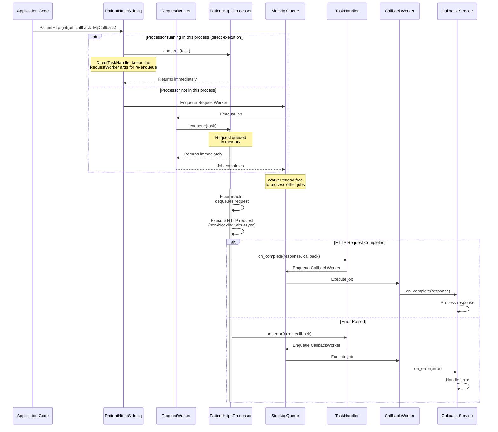
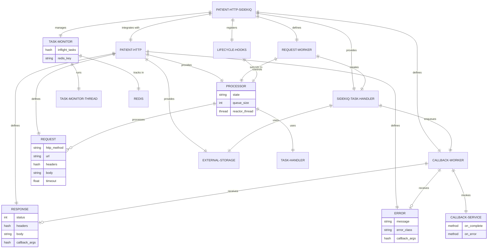

# Architecture

## Overview

PatientHttp::Sidekiq provides a Sidekiq integration layer for the [patient_http](https://github.com/bdurand/patient_http) gem, enabling long-running HTTP requests to be offloaded from Sidekiq worker threads to a dedicated async I/O processor. This integration uses Sidekiq's job system for request enqueueing and callback invocation, while leveraging patient_http's Fiber-based concurrency to handle hundreds of concurrent HTTP requests without blocking worker threads.

## Key Design Principles

1. **Non-blocking Workers**: Worker threads enqueue HTTP requests via Sidekiq jobs and immediately return, freeing them to process other jobs
2. **Processor per Profile**: Each Sidekiq process runs one async I/O processor (from patient_http) for each configured processor profile. Most applications use only the default processor.
3. **Callback Service Pattern**: HTTP responses are processed by callback service classes with `on_complete` and `on_error` methods, invoked via Sidekiq jobs
4. **Lifecycle Integration**: Processor lifecycle is tightly coupled with Sidekiq's startup, quiet, and shutdown events
5. **Sidekiq-Native Task Handling**: Request lifecycle operations (enqueueing, callbacks, retries) use Sidekiq's job system

## Core Components

### PatientHttp::Processor (from patient_http gem)
The heart of the system. Each processor runs in a dedicated thread with its own Fiber reactor. It manages the async HTTP request queue and handles concurrent request execution using Ruby's `async` gem with HTTP/2 connection pooling. `PatientHttp::Sidekiq` starts one processor for each processor profile when the Sidekiq server starts.

### TaskHandler
Implements the patient_http's `TaskHandler` interface to integrate with Sidekiq's job system:
- Enqueues `CallbackWorker` jobs when requests complete or error
- Handles request retries via `Sidekiq::Client.push`
- Manages large payloads via `ExternalStorage` before enqueueing

### RequestWorker
A Sidekiq worker that receives HTTP request specifications and submits them to the async processor. This allows HTTP requests to be made from anywhere in your code (Rails controllers, background jobs, rake tasks, etc.) by enqueueing a job.

### CallbackWorker
A Sidekiq worker that invokes callback service methods (`on_complete` or `on_error`) when HTTP requests complete. Handles payload decryption and external storage retrieval.

### LifecycleHooks
Registers Sidekiq server lifecycle hooks to automatically:
- Start the processor when Sidekiq starts (`:startup` event)
- Drain the processor when Sidekiq receives TSTP signal (`:quiet` event)
- Stop the processor gracefully when Sidekiq shuts down (`:shutdown` event)

### RequestHelper Handler Registration
When the gem loads, it registers a handler with `PatientHttp.register_handler`, so that the `PatientHttp` module methods and the `RequestHelper` `async_*` methods work in every process that loads the gem. The handler translates those calls into `PatientHttp::Sidekiq.execute` invocations. The handler stays registered for the life of the process. After the processors stop, requests are enqueued in Redis for another process to run.

### ProcessorObserver
Adds each request to the `TaskMonitor` crash-recovery registry when a processor accepts it, and removes it when the request finishes or a Sidekiq job owns the request again. It also records request stats for the Web UI.

### TaskMonitor
Manages crash recovery by tracking in-flight requests in Redis:
- Maintains a sorted set of request IDs indexed by timestamp
- Stores request payloads with metadata for recovery
- Detects orphaned requests when processes crash
- Re-enqueues orphaned requests via Sidekiq

### TaskMonitorThread
Background thread that periodically:
- Updates heartbeat timestamps for in-flight requests
- Scans for orphaned requests from crashed processes
- Performs garbage collection on stale Redis data
- Publishes this process's capacity and flushes local stats to Redis

### Request/Response/Error (from patient_http gem)
Value objects representing HTTP requests and their results. All are JSON-serializable for passing through Sidekiq jobs.

### ExternalStorage (from patient_http gem)
Stores large payloads (requests, responses, errors) in the registered payload store when they exceed `payload_store_threshold`, so that Sidekiq job arguments stay small.

### Configuration
`PatientHttp::Sidekiq::Configuration` extends patient_http's configuration with Sidekiq-specific options, including:
- Sidekiq job options for `RequestWorker` and `CallbackWorker`
- Direct execution
- Crash-recovery heartbeat and orphan intervals
- In-flight request details for the Web UI
- Named processor profiles

## Callback Service Pattern

When HTTP requests complete, the processor enqueues CallbackWorker jobs to invoke the appropriate callback service method:

- **Success callbacks**: The `on_complete` method receives a `Response` object with status, headers, body, and callback arguments
- **Error callbacks**: The `on_error` method receives an `Error` object with error details and callback arguments
- **Callback arguments** are passed via the `callback_args:` option and accessed via `response.callback_args[:key]` or `error.callback_args[:key]`

Example:
```ruby
# Define a callback service class
class FetchDataCallback
  def on_complete(response)
    user_id = response.callback_args[:user_id]
    User.find(user_id).update!(data: response.json)
  end

  def on_error(error)
    user_id = error.callback_args[:user_id]
    Rails.logger.error("Failed to fetch data for user #{user_id}: #{error.message}")
  end
end

# Make a request from anywhere in your code
PatientHttp.get(
  "https://api.example.com/users/123",
  callback: FetchDataCallback,
  callback_args: {user_id: 123}
)
```

## Request Lifecycle


```mermaid
sequenceDiagram
    participant App as Application Code
    participant Module as PatientHttp::Sidekiq
    participant ReqWorker as RequestWorker
    participant Processor as PatientHttp::Processor
    participant Sidekiq as Sidekiq Queue
    participant Handler as TaskHandler
    participant CbWorker as CallbackWorker
    participant Callback as Callback Service

    App->>Module: PatientHttp.get(url, callback: MyCallback)

    alt Processor running in this process (direct execution)
        Module->>Processor: enqueue(task)
        Note over Module: DirectTaskHandler keeps the<br/>RequestWorker args for re-enqueue
        Processor-->>Module: Returns immediately
    else Processor not in this process
        Module->>Sidekiq: Enqueue RequestWorker
        Sidekiq->>ReqWorker: Execute job
        ReqWorker->>Processor: enqueue(task)
        activate Processor
        Note over Processor: Request queued<br/>in memory
        Processor-->>ReqWorker: Returns immediately
        ReqWorker-->>Sidekiq: Job completes
        deactivate Processor
    end

    Note over Sidekiq: Worker thread free<br/>to process other jobs

    activate Processor
    Processor->>Processor: Fiber reactor<br/>dequeues request
    Processor->>Processor: Execute HTTP request<br/>(non-blocking with async)

    alt HTTP Request Completes
        Processor->>Handler: on_complete(response, callback)
        Handler->>Sidekiq: Enqueue CallbackWorker
        Sidekiq->>CbWorker: Execute job
        CbWorker->>Callback: on_complete(response)
        Callback->>Callback: Process response
    else Error Raised
        Processor->>Handler: on_error(error, callback)
        Handler->>Sidekiq: Enqueue CallbackWorker
        Sidekiq->>CbWorker: Execute job
        CbWorker->>Callback: on_error(error)
        Callback->>Callback: Handle error
    end
    deactivate Processor
```

Key integration points:
1. **RequestWorker** converts Sidekiq job args into patient_http Request objects
2. **TaskHandler** converts processor callbacks into Sidekiq jobs
3. **CallbackWorker** invokes the user's callback service methods
4. **ExternalStorage** handles large payloads transparently at each step

Direct execution (enabled by default with `config.direct_execution`) skips the `RequestWorker` enqueue when the processor runs in the current process. The request gets a `DirectTaskHandler` that holds the `RequestWorker` job arguments, so every re-enqueue path (processor shutdown, crash recovery, and the at-capacity fallback) can enqueue the request as a normal `RequestWorker` job. The handler exposes a minimal job record for the crash-recovery registry because the orphan sweep pushes the stored record from another process. Requests made in a `with_sidekiq_options` block and requests made while `Sidekiq::Testing` is enabled always go through the queue, so that Sidekiq applies the options. Options set with `config.sidekiq_options` (including a `queue`) do not apply to direct-executed requests, because no Sidekiq job is created; set `config.direct_execution = false` to route every request through the configured queue. A failure to write the crash-recovery registry entry rejects the request and raises to the caller, the same as a failed enqueue.

## Component Relationships


```mermaid
erDiagram
    PATIENT-HTTP-SIDEKIQ ||--|| PATIENT-HTTP : "integrates with"
    PATIENT-HTTP-SIDEKIQ ||--|| SIDEKIQ-TASK-HANDLER : "provides"
    PATIENT-HTTP-SIDEKIQ ||--|| REQUEST-WORKER : "defines"
    PATIENT-HTTP-SIDEKIQ ||--|| CALLBACK-WORKER : "defines"
    PATIENT-HTTP-SIDEKIQ ||--|| TASK-MONITOR : "manages"
    PATIENT-HTTP-SIDEKIQ ||--|| LIFECYCLE-HOOKS : "registers"

    PATIENT-HTTP ||--|| PROCESSOR : "provides"
    PATIENT-HTTP ||--|| REQUEST : "defines"
    PATIENT-HTTP ||--|| RESPONSE : "defines"
    PATIENT-HTTP ||--|| ERROR : "defines"
    PATIENT-HTTP ||--|| EXTERNAL-STORAGE : "provides"

    PROCESSOR ||--|| TASK-HANDLER : "uses"
    PROCESSOR ||--o{ REQUEST : "processes"

    SIDEKIQ-TASK-HANDLER ||--|| CALLBACK-WORKER : "enqueues"
    SIDEKIQ-TASK-HANDLER ||--|| EXTERNAL-STORAGE : "uses"

    REQUEST-WORKER ||--|| PROCESSOR : "submits to"
    REQUEST-WORKER ||--|| SIDEKIQ-TASK-HANDLER : "creates"

    CALLBACK-WORKER ||--|| CALLBACK-SERVICE : "invokes"
    CALLBACK-WORKER ||--o| RESPONSE : "receives"
    CALLBACK-WORKER ||--o| ERROR : "receives"

    TASK-MONITOR ||--|| TASK-MONITOR-THREAD : "runs"
    TASK-MONITOR ||--|| REDIS : "tracks in"

    LIFECYCLE-HOOKS ||--|| PROCESSOR : "controls"

    PROCESSOR {
        string state
        int queue_size
        thread reactor_thread
    }

    REQUEST {
        string http_method
        string url
        hash headers
        string body
        float timeout
    }

    RESPONSE {
        int status
        hash headers
        string body
        hash callback_args
    }

    ERROR {
        string message
        string error_class
        hash callback_args
    }

    CALLBACK-SERVICE {
        method on_complete
        method on_error
    }

    TASK-MONITOR {
        hash inflight_tasks
        string redis_key
    }
```

### Integration Points

**Sidekiq → patient_http:**
- `RequestWorker` converts Sidekiq job args to `PatientHttp::Request` objects
- `TaskHandler` implements `PatientHttp::TaskHandler` interface
- `Processor` is created and managed by the Sidekiq integration layer

**patient_http → Sidekiq:**
- Processor calls `TaskHandler#on_complete` and `TaskHandler#on_error` callbacks
- `TaskHandler` enqueues `CallbackWorker` jobs via Sidekiq
- Large payloads are stored via `ExternalStorage` before enqueueing

## Process Model

Each Sidekiq process runs:
- Multiple worker threads (configured with Sidekiq concurrency)
- **One** async HTTP processor thread (from patient_http) for each processor profile, with one fiber reactor in each
- Completion worker threads for each processor (`completion_threads`, default 2) that decode responses and deliver results
- **One** task monitor thread for crash recovery, shared by all processors

```
┌─────────────────────────────────────────────────────────────┐
│                    Sidekiq Process                          │
│                                                             │
│  ┌──────────────┐   ┌──────────────┐  ┌──────────────┐      │
│  │ Worker       │   │ Worker       │  │ Worker       │      │
│  │ Thread 1     │   │ Thread 2     │  │ Thread N     │      │
│  │              │   │              │  │              │      │
│  │ Executes:    │   │ Executes:    │  │ Executes:    │      │
│  │ - RequestW.  │   │ - CallbackW. │  │ - Other Jobs │      │
│  └──────┬───────┘   └──────┬───────┘  └──────┬───────┘      │
│         │                  │                 │              │
│         └──────────────────┼─────────────────┘              │
│                            │                                │
│                            ▼                                │
│               ┌─────────────────────────┐                   │
│               │  PatientHttp          │                   │
│               │  Processor              │                   │
│               │  (Dedicated Thread)     │                   │
│               │                         │                   │
│               │  ┌───────────────────┐  │                   │
│               │  │  Async Fiber      │  │                   │
│               │  │  Reactor          │  │                   │
│               │  │  ═════════════    │  │                   │
│               │  │  - HTTP/2 pools   │  │                   │
│               │  │  - 100+ concurrent│  │                   │
│               │  │    requests       │  │                   │
│               │  │  - Non-blocking   │  │                   │
│               │  │    I/O            │  │                   │
│               │  └───────────────────┘  │                   │
│               └─────────────────────────┘                   │
│                            │                                │
│               ┌────────────┴─────────────┐                  │
│               │  TaskMonitorThread       │                  │
│               │  (Crash Recovery)        │                  │
│               │                          │                  │
│               │  - Heartbeat updates     │                  │
│               │  - Orphan detection      │                  │
│               │  - Redis GC              │                  │
│               └──────────────────────────┘                  │
└─────────────────────────────────────────────────────────────┘
                            │
                            ▼
                    ┌───────────────┐
                    │     Redis     │
                    │               │
                    │  - Job queues │
                    │  - Inflight   │
                    │    tracking   │
                    │  - Payloads   │
                    └───────────────┘
```

### Architectural Layers

**Application Layer:**
- User code calls `PatientHttp.get`, `PatientHttp.post`, and the other module methods
- Or includes `PatientHttp::RequestHelper` for `async_get/async_post/etc` instance methods
- Callback services implement `on_complete` and `on_error`

**Sidekiq Integration Layer (this gem):**
- `RequestWorker` - Sidekiq job to submit requests
- `CallbackWorker` - Sidekiq job to invoke callbacks
- `TaskHandler` - Bridges processor callbacks to Sidekiq jobs
- `LifecycleHooks` - Manages processor lifecycle
- `TaskMonitor` - Crash recovery and inflight tracking

**HTTP Processing Layer (patient_http):**
- `Processor` - Main async I/O processor
- `Request/Response/Error` - Value objects
- `ExternalStorage` - Large payload handling
- Async fiber scheduler and HTTP/2 connection pools

## Concurrency Model

The system uses multiple levels of concurrency:

### Sidekiq Worker Threads
- Process Sidekiq jobs from queues
- Execute `RequestWorker` and `CallbackWorker` jobs
- Block only briefly while submitting requests to the processor

### Async HTTP Processor Thread (from patient_http)
- Runs Ruby's Fiber scheduler (`async` gem) for non-blocking I/O
- Maintains HTTP/2 connection pools for efficient connection reuse
- Multiplexes hundreds of concurrent HTTP requests via fibers
- Each HTTP request runs in its own fiber (lightweight concurrency)

### Task Monitor Thread
- Periodically updates Redis heartbeats for in-flight requests
- Scans for orphaned requests from crashed processes
- Performs garbage collection on stale data

**Benefits:**
1. **Worker threads remain free** - handing a request to the processor returns without waiting for the response
2. **Fiber-based multiplexing** - handle hundreds of concurrent requests in a single thread
3. **HTTP/2 connection reuse** - multiple requests share persistent connections
4. **Non-blocking I/O** - fibers yield during network I/O, allowing other requests to progress

## State Management

The processor (from patient_http) maintains state through its lifecycle, managed by Sidekiq lifecycle hooks:

- **stopped**: Initial state, not processing requests
- **starting**: Processor is initializing, reactor thread launching
- **running**: Actively processing requests
- **draining**: Not accepting new requests (triggered by Sidekiq's `:quiet` event), completing in-flight
- **stopping**: Shutting down (triggered by Sidekiq's `:shutdown` event), waiting for requests to finish

**Lifecycle Integration:**

```ruby
# Registered automatically via LifecycleHooks
Sidekiq.configure_server do |config|
  config.on(:startup) { PatientHttp::Sidekiq.start }    # → processor state: running
  config.on(:quiet)   { PatientHttp::Sidekiq.quiet }    # → processor state: draining
  config.on(:shutdown) { PatientHttp::Sidekiq.stop }    # → processor state: stopping
end
```

## Crash Recovery

In-flight requests are tracked in Redis to enable recovery when Sidekiq processes crash:

### TaskMonitor
- Maintains a Redis sorted set of in-flight request IDs indexed by timestamp
- Stores request payloads with metadata (Sidekiq job, callback info)
- Each process has a unique process ID: `hostname:pid:hex`

### TaskMonitorThread
- Runs in background, periodically updating heartbeat timestamps in Redis
- Scans for orphaned requests (no heartbeat update within threshold)
- Re-enqueues orphaned requests via `Sidekiq::Client.push`

### Recovery Process
1. `ProcessorObserver` registers a request with `TaskMonitor` when the processor accepts it (before `Processor#enqueue` returns) and unregisters it when the request completes or when a Sidekiq job owns the request again (rejected or re-enqueued)
2. `TaskMonitorThread` updates heartbeat timestamps in Redis for all tracked requests (queued, pending, and in-flight)
3. If a process crashes, heartbeat updates stop
4. Other processes' monitor threads detect stale timestamps
5. Orphaned requests are atomically removed and re-enqueued
6. Prevents lost work during deployments or crashes

Recovery gives at-least-once delivery. A crash between a re-enqueue and the removal of the registry entry can execute a request more than once, so callbacks must be idempotent. A request is durable once the submitting call returns; a crash during the call behaves like a failed enqueue.

**Redis Keys:**
- `sidekiq:patient_http:inflight_index` - Sorted set of request IDs by timestamp
- `sidekiq:patient_http:inflight_jobs` - Hash of request payloads
- `sidekiq:patient_http:inflight_details` - Hash of the URL, HTTP method, and processor of each in-flight request, for the Web UI
- `sidekiq:patient_http:inflight_details_index` - Sorted set of the in-flight request details by start time
- `sidekiq:patient_http:processes` - Set of active process IDs
- `sidekiq:patient_http:gc_lock` - Distributed lock for garbage collection
- `sidekiq:patient_http:gc_last_run` - Timestamp of last garbage collection run
- `sidekiq:patient_http:totals` - Aggregated request stats for the Web UI

## Configuration

Configuration is split between Sidekiq-specific concerns and patient_http settings:

### Sidekiq Integration Settings
```ruby
PatientHttp.configure do |config|
  # Sidekiq worker options (applied to both RequestWorker and CallbackWorker)
  config.sidekiq_options = {queue: "patient_http", retry: 5}

  # Skip the Sidekiq queue when the processor runs in the current process
  config.direct_execution = true

  # Encryption (for sensitive data in Sidekiq jobs; inherited from PatientHttp::Configuration)
  config.encryption_key = ENV["PATIENT_HTTP_ENCRYPTION_KEY"]

  # External storage threshold (for large payloads)
  config.payload_store_threshold = 100_000   # bytes

  # Shutdown timeout in seconds. Must be less than Sidekiq's shutdown timeout.
  config.shutdown_timeout = 23
end
```

### Async HTTP Pool Settings (delegated)
All patient_http configuration is accessible:
```ruby
PatientHttp.configure do |config|
  # HTTP settings
  config.request_timeout = 30
  config.max_connections = 100

  # Retry behavior
  config.retries = 3

  # Proxy settings
  config.proxy_url = ENV["HTTP_PROXY"]
end
```

The configuration object is passed to each `PatientHttp::Processor` on startup. A named processor profile gets a view of the configuration with its own overrides applied.

## Web UI

Optional Sidekiq Web integration (the `WebUI` module) provides:

- Total requests, errors, times at capacity, average duration, and capacity utilization
- The same stats for each processor, with the in-flight high-water mark, when more than one processor profile is configured
- The oldest in-flight requests, with their URL, HTTP method, processor, and age
- In-flight request counts and capacity for each process

The Web UI reads from:
- `Stats` Redis keys for request totals
- `TaskMonitor` Redis keys for in-flight requests and details
- The process set, where each process publishes its capacity with its heartbeat

## Data Flow

### Making a Request

```
Application Code
  ↓ PatientHttp.get(url, callback: MyCallback)
RequestWorker job enqueued
  ↓ Sidekiq processes job
RequestWorker#perform
  ↓ Creates RequestTask with a TaskHandler
PatientHttp::Processor#enqueue(task)
  ↓ ProcessorObserver#request_enqueued
TaskMonitor#register
  ↓ Stored in Redis before the task is queued
Task queued in memory
  ↓
Fiber reactor processes request
  ↓ Non-blocking HTTP I/O
Response/Error received
```

With direct execution (the default), a request made in a process with a running
processor skips the enqueue and the `RequestWorker#perform` steps. A
`DirectTaskHandler` holds the `RequestWorker` job arguments, and the request
goes straight to the processor. The rest of the flow is identical, and the
re-enqueue paths use the handler to enqueue a normal `RequestWorker` job when
needed.

### Processing a Response

```
Fiber completes with Response
  ↓
TaskHandler#on_complete(response, callback)
  ↓ Stores via ExternalStorage if large
CallbackWorker job enqueued
  ↓ ProcessorObserver#request_end
TaskMonitor#unregister
  ↓ Removed from Redis
Sidekiq processes CallbackWorker job
  ↓
CallbackWorker#perform
  ↓ Fetches from ExternalStorage if needed
  ↓ Decrypts payload
MyCallback.new.on_complete(response)
  ↓ User code executes
```

## Thread Safety

- **Thread-safe submission**: `Processor` uses thread-safe queues for request submission
- **Atomic state changes**: Processor state managed with atomic operations
- **Redis-based coordination**: TaskMonitor uses Redis for distributed coordination
- **Sidekiq job isolation**: Each CallbackWorker job runs on a Sidekiq worker thread

## Further Reading

- [README](README.md)
